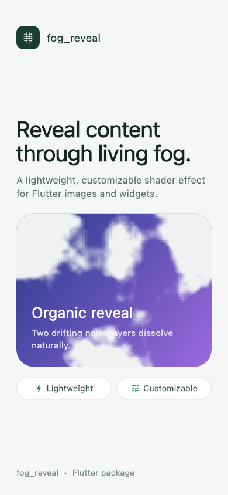
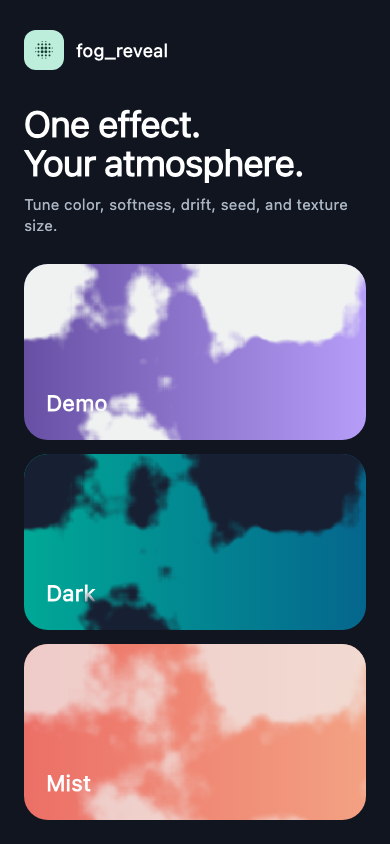

# fog_reveal

A lightweight Flutter shader that reveals images and widgets through soft,
organic fog.

- Declarative `revealed` state for image loaders and asynchronous content
- Automatic playback with no controller boilerplate
- Optional replay, seek, pause, cover, and looping controls
- Custom fog color, softness, motion, noise seed, and texture resolution
- Shared noise textures between matching active widgets
- No third-party runtime dependencies or external image assets

## Preview

| Organic reveal | Custom styles |
| :---: | :---: |
|  |  |

## Installation

```sh
flutter pub add fog_reveal
```

Import the package:

```dart
import 'package:fog_reveal/fog_reveal.dart';
```

The shader is bundled and registered by the package. Consuming apps do not need
to declare it in their `pubspec.yaml`.

## Quick start

With no controller, the reveal starts automatically after shader resources are
ready:

```dart
AnimatedFogReveal(
  borderRadius: BorderRadius.circular(24),
  child: Image.network(imageUrl, fit: BoxFit.cover),
)
```

The default appearance matches the included reference demo: 2800 ms,
`Curves.easeInOutCubic`, `Color(0xFFF0F2F2)`, 0.1 softness, 6 drift, seed
1709, and a 256 px texture.

## Image-loader state

Connect `revealed` to the loaded state already reported by your image loader or
cache library:

```dart
AnimatedFogReveal(
  revealed: imageLoaded,
  duration: const Duration(milliseconds: 1200),
  style: FogStyle.lightweight,
  borderRadius: BorderRadius.circular(20),
  child: image,
)
```

Changing `revealed` to true reveals from the current position. Changing it back
to false covers smoothly. The child remains mounted throughout.

`revealed`, `duration`, `reverseDuration`, and `initialProgress` control the
internally created controller. They are intentionally ignored when an external
`controller` is supplied.

## Customize appearance

```dart
const style = FogStyle(
  color: Color(0xD9E8F7FF),
  softness: 0.16,
  drift: 4,
  seed: 42,
  textureSize: 128,
);

AnimatedFogReveal(
  style: style,
  child: yourWidget,
)
```

| Setting | Default | Valid values |
| --- | ---: | --- |
| `color` | `Color(0xFFF0F2F2)` | Alpha controls maximum fog opacity |
| `softness` | `0.1` | Greater than 0, up to 0.5 |
| `drift` | `6` | -1000 to 1000; 0 freezes cloud movement |
| `seed` | `1709` | 0 to 2147483647 |
| `textureSize` | `256` | 16 to 512 pixels |

Presets: `FogStyle.demo`, `FogStyle.light`, `FogStyle.dark`, `FogStyle.mist`,
and `FogStyle.lightweight`. Use `copyWith(...)` to change one property.

`FogStyle.lightweight` keeps the demo appearance but uses a 128 px texture. It
is recommended for dense lists and grids.

## Looping

No controller is required:

```dart
AnimatedFogReveal(
  loop: true,
  child: yourWidget,
)
```

`loop: true` repeats covered-to-revealed passes. Setting it to false lets the
current pass finish. For an internally controlled widget, looping pauses while
`revealed` is false.

Looping uses `AnimationController.repeat()`, so `onEnd` is not called for each
loop cycle. It runs when a non-repeating reveal reaches either endpoint.

## Playback controller

Use a controller for replay, scrubbing, pause/resume, or imperative playback:

```dart
class _ExampleState extends State<Example>
    with SingleTickerProviderStateMixin {
  late final fog = FogRevealController(vsync: this);

  @override
  void dispose() {
    fog.dispose();
    super.dispose();
  }

  @override
  Widget build(BuildContext context) => AnimatedFogReveal(
        controller: fog,
        onReady: fog.replay,
        child: yourWidget,
      );
}
```

The controller provides `reveal()`, `cover()`, `replay()`, `pause()`,
`resume()`, `seek()`, and `toggle()`. Standard `AnimationController` methods,
including `repeat()`, remain available. The owner must dispose a supplied
controller.

When `loop: true` is used with a supplied controller, the widget starts and
stops the repeat simulation. Removing the widget or replacing the controller
stops only a loop started by the widget; the controller itself is not disposed.

## Lower-level APIs

Use direct progress:

```dart
FogReveal(
  progress: progress,
  child: yourWidget,
)
```

Or connect any `Animation<double>`:

```dart
FogTransition(
  animation: animation,
  curve: Curves.easeInOutCubic,
  child: yourWidget,
)
```

`FogTransition` keeps raw motion progress separate from eased dissolve progress,
matching the reference demo.

## Loading, accessibility, and performance

- Before the shader is ready, or if loading fails, the child is shown without
  fog. Use `onReady` and `onError` when the surrounding UI must track that state.
- `onReady` runs after the initial load and after successful `seed` or
  `textureSize` reloads. A reload does not restart completed internal playback.
- `blockInteraction: true` blocks pointer input until fully revealed.
- `excludeSemantics: true` hides child semantics until fully revealed. Neither
  option is a security boundary.
- Widgets with the same `seed` and `textureSize` share one texture while active.
  Custom colors, softness, and drift do not create another texture.
- Noise generation runs on the UI isolate. Prefer 64 or 128 px textures in large
  lazy lists, and do not change `seed` every frame.
- A 256 px RGBA noise texture uses about 256 KiB before engine overhead; a
  128 px texture uses about 64 KiB.
- Give the child finite dimensions inside an unbounded parent.
- The effect requires a Flutter rendering backend with fragment-shader support.

Requires Flutter 3.27+ and Dart 3.6+.

See [`example/lib/main.dart`](example/lib/main.dart),
[`README_UZ.md`](README_UZ.md), and [`PUBLISHING.md`](PUBLISHING.md).
